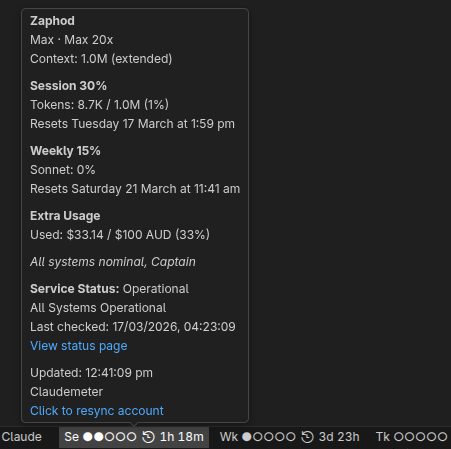

# Claudemeter

[](https://github.com/hyperi-io/claudemeter/issues)
[](https://github.com/hyperi-io/claudemeter)


> Monitor your Claude Code usage in real time, with full limit information.
> *No more 'Surprise! You've hit your Claude Code weekly limit and it resets in 3 days you lucky, lucky person!'*



- Token context usage
- Session limits
- Weekly limits
- Limit consumption and reset times
- Claude service status (working, partial outage, major outage)
- Claude session and login all local to device
- Open source: <https://github.com/hyperi-io/claudemeter>

---

## Status Bar Default


## Minimal Status Bar


## Compact Status Bar


## 12 Hour


## 24 Hour


## Context Window Detection

Claudemeter automatically detects your context window size — no manual configuration needed.

Claude Code defaults all models to **200K context**, even on Max plans. Extended context (1M, 2M, etc.) is only active when you explicitly enable it via the model suffix — for example, selecting `opus[1m]` in the Claude Code model picker.

Claudemeter detects this using three signals (highest wins):

1. **Claude Code model setting** — reads the `claudeCode.selectedModel` VS Code setting (e.g. `opus[1m]` → 1M)
2. **Observed token usage** — if `cache_read` tokens exceed 200K during a session, the limit is at least that high
3. **JSONL model IDs** — future-proofing for when Claude Code writes the suffix into session files

The suffix format is dynamic: `[1m]` = 1M tokens, `[2m]` = 2M, `[500k]` = 500K. No code changes needed when Anthropic increases context sizes.

When extended context is active, the tooltip shows **"Context: 1.0M (extended)"**. To override auto-detection, set `claudemeter.tokenLimit` to a specific value.

## How It Works

Claudemeter v2 uses streamlined HTTP requests to fetch your usage data directly from Claude.ai's API endpoints. A browser is only needed once for the initial login — after that, your session cookie is stored locally and all subsequent fetches complete in 1-3 seconds with no browser overhead.

When you log in, the extension verifies that the browser account matches the account used by Claude Code CLI. If the accounts don't match, it will prompt you to log in with the correct account.

> **Why not use the Claude CLI's OAuth token?** The CLI's OAuth scopes (`user:inference`, `user:profile`, etc.) don't grant access to the usage/billing endpoints. Only the `sessionKey` cookie from a browser login works. If Anthropic ever expands the CLI scopes, the browser login could be eliminated entirely.

> **Why keep puppeteer-core?** The usage API endpoints are undocumented and could change without notice. `puppeteer-core` (bundled into the extension, no bundled Chromium) handles the login flow and powers an opt-in legacy scraper fallback if the API breaks. See `claudemeter.useLegacyScraper` in settings.

## Installation

### Prerequisites

- VS Code 1.109.0 or higher
- A Chromium-based browser for login (Chrome, Chromium, Brave, Edge, Arc, Vivaldi, or Opera)

### Install from VS Code Marketplace

Search for **Claudemeter** in the VS Code Extensions panel (`Ctrl+Shift+X` / `Cmd+Shift+X`) and click **Install**.

### Install from a Forked Repository

If you want to test changes from a fork or contribute to development:

1. **Fork and clone** the repository:

   ```bash
   git clone https://github.com/<your-username>/claudemeter.git
   cd claudemeter
   ```

2. **Install dependencies and build**:

   ```bash
   npm ci
   npm run build
   ```

3. **Package the extension** as a `.vsix` file:

   ```bash
   npx @vscode/vsce package --no-dependencies
   ```

   This produces a file like `claudemeter-2.x.x.vsix` in the project root.

4. **Install the `.vsix` in VS Code**:

   - Open the Extensions panel (`Ctrl+Shift+X` / `Cmd+Shift+X`)
   - Click the **`···`** menu (top-right of the Extensions panel)
   - Select **Install from VSIX…**
   - Choose the `.vsix` file you just built

   Or via the command line:

   ```bash
   code --install-extension claudemeter-*.vsix
   ```

5. **Reload VS Code** when prompted.

> **Tip:** For iterative development without rebuilding a VSIX each time, open the repo in VS Code and press `F5` to launch an **Extension Development Host** — a second VS Code window with your local changes loaded. This requires the `vscode` engine version to match; see `.vscode/launch.json` for the run configuration.

## First-Time Setup

1. On first launch, the extension prompts you to log in
2. Click **Log In Now** — a browser window opens to Claude.ai
3. Complete the Cloudflare verification ("Are you human?") if prompted
4. Log in with your credentials (Google, email, etc.)
5. The extension verifies the browser account matches your CLI account, saves the session cookie locally, and closes the browser
6. All future fetches use fast HTTP requests — no browser needed

When switching Claude Code accounts, the extension detects the change and prompts you to re-login. The login browser cache is cleared so you get a fresh login for the new account.

## Configuration

Open VS Code Settings and search for "Claudemeter" to configure:

### `claudemeter.fetchOnStartup`

- **Type**: Boolean
- **Default**: `true`
- **Description**: Automatically fetch usage data when VS Code starts

### `claudemeter.autoRefreshMinutes`

- **Type**: Number
- **Default**: `5`
- **Range**: `1-60` minutes
- **Description**: Auto-refresh interval in minutes for fetching Claude.ai usage data via HTTP. Each fetch takes 1-3 seconds with no browser overhead.

### `claudemeter.localRefreshSeconds`

- **Type**: Number
- **Default**: `10`
- **Range**: `5-60` seconds
- **Description**: Local token refresh interval in seconds. Controls how often local Claude Code token data is polled from JSONL files. This is a low-overhead local operation (no web requests). Set higher to reduce CPU usage.

### `claudemeter.tokenLimit`

- **Type**: Number
- **Default**: `0` (auto-detect)
- **Range**: `0-2000000`
- **Description**: Context window token limit override. Set to `0` (default) to auto-detect from Claude Code's model selection. Set manually to force a specific limit.

### `claudemeter.tokenOnlyMode`

- **Type**: Boolean
- **Default**: `false`
- **Description**: Token-only mode - only track Claude Code tokens, skip Claude.ai usage fetching entirely

### `claudemeter.useLegacyScraper`

- **Type**: Boolean
- **Default**: `false`
- **Description**: Use the legacy browser-based scraper instead of streamlined HTTP fetching. The default HTTP method calls undocumented Claude.ai API endpoints that could change without notice. Enable this fallback if the HTTP method stops working due to API changes. Requires a Chromium-based browser.

### `claudemeter.statusBar.displayMode`

- **Type**: String
- **Default**: `default`
- **Options**: `default`, `minimal`, `compact`
- **Description**: Status bar display mode:
  - **default**: Full display with reset times (separate panels)
  - **minimal**: Percentages only (separate panels)
  - **compact**: All metrics in a single panel

### `claudemeter.statusBar.showSonnet`

- **Type**: Boolean
- **Default**: `false`
- **Description**: Show Sonnet weekly usage in status bar (default/minimal modes only)

### `claudemeter.statusBar.showOpus`

- **Type**: Boolean
- **Default**: `false`
- **Description**: Show Opus weekly usage in status bar (Max plans only, default/minimal modes)

### `claudemeter.statusBar.showCredits`

- **Type**: Boolean
- **Default**: `false`
- **Description**: Show extra usage (spending cap) in status bar (default/minimal modes only)

### `claudemeter.statusBar.showServiceStatus`

- **Type**: Boolean
- **Default**: `true`
- **Description**: Show Claude service status indicator. Displays a warning/error icon if Claude services are degraded or experiencing an outage.

### `claudemeter.statusBar.timeFormat`

- **Type**: String
- **Default**: `countdown`
- **Options**: `12hour`, `24hour`, `countdown`
- **Description**: How to display reset times in the status bar:
  - **12hour**: 12-hour format with AM/PM (e.g., 2:30 PM)
  - **24hour**: 24-hour format (e.g., 14:30)
  - **countdown**: Countdown timer (e.g., 2h 15m)

### `claudemeter.statusBar.usageFormat`

- **Type**: String
- **Default**: `barCircle`
- **Options**: `percent`, `barLight`, `barSolid`, `barSquare`, `barCircle`
- **Description**: How to display usage values in the status bar:
  - **percent**: Percentage (e.g., 60%)
  - **barLight**: Light blocks (e.g., ????)
  - **barSolid**: Solid blocks (e.g., ????)
  - **barSquare**: Squares (e.g., ?????)
  - **barCircle**: Circles (e.g., ?????)

### `claudemeter.statusBar.alignment`

- **Type**: String
- **Default**: `right`
- **Options**: `left`, `right`
- **Description**: Status bar alignment. Requires window reload to take effect.

### `claudemeter.statusBar.priority`

- **Type**: Number
- **Default**: `100`
- **Range**: `0-10000`
- **Description**: Status bar priority (higher values position items closer to the center). Requires window reload to take effect.

### `claudemeter.debug`

- **Type**: Boolean
- **Default**: `false`
- **Description**: Enable debug logging to output channel (for troubleshooting)

### `claudemeter.debugLogFile`

- **Type**: String
- **Default**: Auto-populated on first run (`~/.config/claudemeter/debug.log` or platform equivalent)
- **Description**: Path to debug log file. Supports `~` for home directory.

### `claudemeter.debugLogMaxSizeKB`

- **Type**: Number
- **Default**: `256`
- **Range**: `64-2048` KB
- **Description**: Maximum debug log file size in KB. Oldest entries are trimmed when exceeded.

### `claudemeter.thresholds.warning`

- **Type**: Number
- **Default**: `80`
- **Range**: `1-100`
- **Description**: Usage percentage to show warning (yellow) indicator

### `claudemeter.thresholds.error`

- **Type**: Number
- **Default**: `90`
- **Range**: `1-100`
- **Description**: Usage percentage to show error (red) indicator

### `claudemeter.thresholds.tokens.warning`

- **Type**: Number
- **Default**: `65`
- **Range**: `1-100`
- **Description**: Token usage warning threshold (VS Code auto-compacts context at ~65-75%)

## Commands

All commands are available via the Command Palette (`Ctrl+Shift+P` / `Cmd+Shift+P`):

- **`Claudemeter: Fetch Claude Usage Now`** - Manually fetch current usage data
- **`Claudemeter: Open Claude Settings Page`** - Open claude.ai/settings in your default browser
- **`Claudemeter: Start New Claude Code Session`** - Start a new token tracking session
- **`Claudemeter: Show Debug Output`** - Open debug output channel
- **`Claudemeter: Login to Claude.ai`** - Open browser for login
- **`Claudemeter: Clear Session (Re-login)`** - Clear saved session and force re-login
- **`Claudemeter: Reset Browser Connection (Legacy)`** - Reset browser connection (legacy scraper mode only)

## Troubleshooting

### Browser won't open for login

- Ensure you have a Chromium-based browser installed (Chrome, Edge, Brave, etc.)
- The extension auto-detects your default browser; if it's not Chromium-based (e.g., Firefox), install Chrome or Edge
- Try running VS Code as administrator (Windows)

### Session expired or fetch errors

- Run **Claudemeter: Clear Session (Re-login)** from the Command Palette
- Or manually delete the session cookie file:
  - macOS: `~/Library/Application Support/claudemeter/session-cookie.json`
  - Linux: `~/.config/claudemeter/session-cookie.json`
  - Windows: `%APPDATA%\claudemeter\session-cookie.json`

### API changes broke usage fetching

- Claude.ai's usage API endpoints are undocumented and may change without notice
- Try enabling the legacy scraper: set `claudemeter.useLegacyScraper` to `true` in settings
- Check if you can see your usage at [claude.ai/settings](https://claude.ai/settings)
- [Report an issue](https://github.com/hyperi-io/claudemeter/issues) so the extension can be updated

### Wrong account after login

- If the extension detects the browser account doesn't match the CLI account, it will prompt you to log in again with the correct account
- Run **Claudemeter: Clear Session (Re-login)** if the issue persists

## Privacy & Security

- **No credentials stored**: The extension never stores or transmits your login credentials
- **Local session cookie**: Your `sessionKey` cookie is saved locally at `~/.config/claudemeter/session-cookie.json` (or platform equivalent) and is only sent to `claude.ai`
- **No data transmission**: Usage data stays on your machine
- **Self-contained**: `puppeteer-core` is bundled into the extension (no external `node_modules` at runtime). It uses your existing system browser for login only — no Chromium is downloaded or bundled.
- **Account verification**: The extension verifies the browser login matches the CLI account before saving the session
- **Open source**: All code is available for review

## Feedback & Issues

If you encounter any issues or have suggestions:

1. Check the troubleshooting section above
2. Review open issues on [GitHub](https://github.com/hyperi-io/claudemeter/issues)
3. Submit a new issue with:
   - VS Code version
   - Extension version
   - Error messages from the Output panel (View > Output > Claudemeter - Token Monitor)
   - Steps to reproduce

## Authors


Paying it forward by the hoopy froods at HyperI (formerly HyperSec)
<https://hyperi.io>

## Development

### HyperI AI Tooling (Internal)

This repo includes an optional `hyperi-ai/` submodule containing the HyperI AI assistant standards and coding conventions. It's a private repo — external contributors can safely ignore it. Clones work normally without the submodule.

**HyperI devs — first-time setup:**

```bash
git submodule update --init hyperi-ai
./hyperi-ai/attach.sh --agent claude
```

**Update to latest:**

```bash
git submodule update --remote hyperi-ai
./hyperi-ai/attach.sh --agent claude
```

## License

MIT License - See LICENSE file for details.

Originally inspired and based on [claude-usage-monitor](https://github.com/Gronsten/claude-usage-monitor) by Mark Campbell.

---

**Note**: This is an unofficial extension and is not affiliated with Anthropic or Claude.ai.
